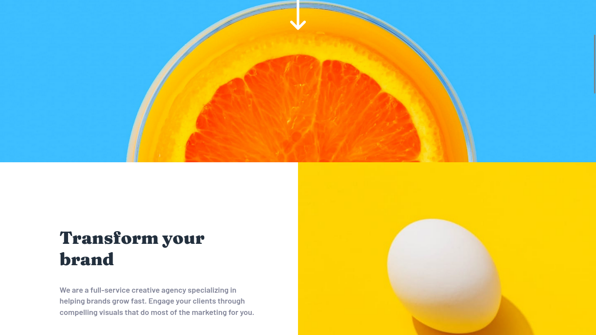

# Frontend Mentor - Sunnyside agency landing page solution

This is a solution to the [Sunnyside agency landing page challenge on Frontend Mentor](https://www.frontendmentor.io/challenges/sunnyside-agency-landing-page-7yVs3B6ef). Frontend Mentor challenges help you improve your coding skills by building realistic projects.

## Table of contents

- [Overview](#overview)
  - [The challenge](#the-challenge)
  - [Screenshot](#screenshot)
  - [Links](#links)
- [My process](#my-process)
  - [Built with](#built-with)
  - [What I learned](#what-i-learned)
  - [Continued development](#continued-development)
  - [Useful resources](#useful-resources)
- [Author](#author)

## Overview

### The challenge

Users should be able to:

- View the optimal layout for the site depending on their device's screen size
- See hover states for all interactive elements on the page

### Screenshot




### Links

- Solution URL: [Solution URL](https://github.com/Kemystra/frontendmentor-sunny-page)
- Live Site URL: [live site URL](https://serene-toffee-c37b96.netlify.app/)

## My process

### Built with

- CSS Variables
- Flexbox
- CSS Grid
- SCSS

### What I learned

1. CSS Orders
I can specify which order an element should be in a flexbox or grid!

```css
#first-div {
    order: 2;
}

#second-div {
    order: 1;
}
```

2. CSS Clip Path
Can be used to crop pictures into desired shapes.
```css
#image {
    // Crop image into a circle of 50% radius
    // right at the center
    clip-path: circle(50% at 50% 50%)
}
```

3. SCSS @each
Very useful to write repetitive CSS!
```scss
// Specify order of children of #promote in its grid.
$element-orders: (
	--transform-brand-text-order: 1,
	--transform-brand-image-order: 2,
	--standout-image-order: 3,
	--standout-text-order: 4,
	--graphic-design-order: 5,
	--photo-order: 6
);

#promote {
    display: grid;
    grid-template-columns: repeat(2, 1fr);

	$i: 0;
	@each $varname, $order in $element-orders {
		#{$varname}: $order;
		$i: $i + 1;

		& > :nth-child(#{$i}) {
			order: var(#{$varname});
		}	
	}
}
```

4. SCSS Imports
Used it to separate files. Really nice, considering that I was working with a single file with 500+ LOC CSS for this challenge. I spent some time refactoring it after realizing this feature, and it was definitely worth it!
```scss
// Import the file '_test.scss'
@use 'test';

// This one imports, but also forwards it.
// The file that will use this file will also be able to use that file.
@forward 'file_that_the_main_file_also_needs';
```

5. Default \ `display` value
It turns out by default, \ have `display: inline-block`, which causes a small gap underneath the image. Its super annoying, and next time I will just do:
```css
// Place this first!
img {
    diplay: block;
}
```

6. \<a\> behaviour without `href` attribute.
The tag will only show the pointer cursor when `href` attribute is present (even if it's empty). Wasted quite a bit of time wondering why the cursor won't change when hovering over an \<a\> tag.

### Continued development

For future challenges, I want to spend more time on accessibility; not just with semantic HTML, but with advanced features like ARIA labels and such.

I'm also intrigued to work on challenges that play with dark and light theme switching. Really wanted to use more CSS & SCSS tricks later.

### Useful resources

- [CSS Tricks: How to Scale SVG](https://css-tricks.com/scale-svg/) - Helped me in finding ways to resizing SVGs, which is used in the site's logo.
-[CSS Tricks: Approaches to Media Queries in Sass](https://css-tricks.com/approaches-media-queries-sass/) - Really opened my eyes to the true power of SASS; I was just a casual @mixin user until now.
- [MDN Web Docs on CSS](https://developer.mozilla.org/en-US/docs/Web/CSS) - Too much to list here but I just want to mention on the abundant methods to use justify-* with Flexbox.
- [Clippy - CSS clip-path maker](https://bennettfeely.com/clippy/) - Very useful to test `clip-path` property in CSS.

## Author

- Frontend Mentor - [@Kemystra](https://www.frontendmentor.io/profile/Kemystra)
